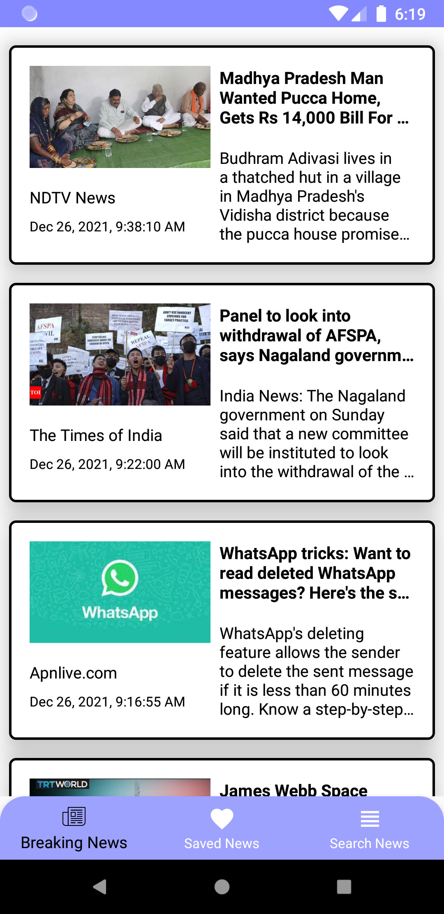

# News-Net
News Net is built using the **MVVM** architecture. It uses **RecyclerView** to display the list of news articles in an resource efficient manner. The user can read and save the article in the local database with the help of **WebView** and **RoomDB** respectively. This app also implements **Pagination**. Fully coded in Kotlin which provides the feature of **Coroutines** to handle long-running tasks. To fetch the data it uses **Retrofit** library. Used **Android Jetpack's Navigation Component** to achieve the navigation between the screens. 

